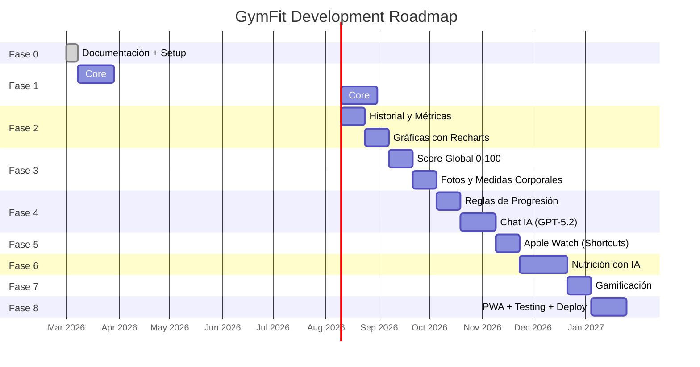

# 🗺️ Roadmap de Desarrollo — GymFit

> Fases de desarrollo con prioridades y estimaciones.

---

## Visión General



---

## Detalle por Fase

### Fase 0: Documentación + Setup (1 semana) ✅

- [x] Documentación completa del proyecto
- [x] Setup Git-Flow (main → develop → feature branches)
- [ ] Inicializar proyecto Next.js 15
- [ ] Configurar Tailwind + Shadcn UI
- [ ] Configurar Prisma + PostgreSQL
- [ ] Configurar ESLint + Prettier
- [ ] PWA manifest + service worker básico

---

### Fase 1: Core — Ejercicios, Rutinas, Logging (6 semanas)

**Branch:** `feature/workout-core`

- [ ] Modelo de datos: Exercise, Routine, RoutineExercise, Program, Block
- [ ] CRUD de ejercicios (biblioteca)
- [ ] Filtros: músculo, patrón, equipo, dificultad
- [ ] CRUD de rutinas con ejercicios prescritos
- [ ] Ejecución de entrenamiento (logging en vivo)
- [ ] Autocompletado con última sesión
- [ ] Temporizador de descansos
- [ ] Guardar sesión (Session + WorkoutSet)
- [ ] Resumen post-entrenamiento

**Criterio de éxito:** Poder registrar un entrenamiento completo en < 2 min extra vs sin app.

---

### Fase 2: Historial y Métricas (4 semanas)

**Branch:** `feature/history-metrics`

- [ ] Historial de sesiones con filtros
- [ ] Historial por ejercicio (todas las veces que hiciste press banca)
- [ ] e1RM estimado por ejercicio
- [ ] Volumen semanal por músculo (gráfica)
- [ ] PRs automáticos (peso, reps, e1RM)
- [ ] Gráficas con Recharts

---

### Fase 3: Progreso — Score, Fotos, Medidas (4 semanas)

**Branch:** `feature/progress`

- [ ] Score global 0-100 con desglose
- [ ] Tendencia de score (gráfica 4-8 semanas)
- [ ] Subida de fotos de progreso
- [ ] Comparación antes/después
- [ ] Registro de métricas corporales (peso, medidas)
- [ ] Peso suavizado (media móvil exponencial)
- [ ] Detección de recomposición (peso estable + fuerza sube)

---

### Fase 4: IA — Progresión + Chat (5 semanas)

**Branch:** `feature/ai-engine`

- [ ] Motor de reglas de progresión (doble progresión, top set)
- [ ] Detección de estancamiento (3-6 semanas)
- [ ] Detección de junk volume
- [ ] Cliente OpenAI GPT-5.2
- [ ] Chat contextual con streaming (SSE)
- [ ] Prompt system con contexto del usuario
- [ ] Generación de rutinas con IA
- [ ] Análisis multivariable

---

### Fase 5: Apple Watch — Shortcuts (2 semanas)

**Branch:** `feature/apple-watch`

- [ ] Endpoint POST /api/recovery con Bearer auth
- [ ] Validación de Recovery Snapshots con Zod
- [ ] Fallback automático (media 7 días)
- [ ] Documentar el Shortcut de iOS (ya hecho)
- [ ] Integrar recovery data con el score global
- [ ] Vista de métricas fisiológicas

---

### Fase 6: Nutrición (4 semanas)

**Branch:** `feature/nutrition`

- [ ] Endpoint de análisis de foto con GPT-5.2 Vision
- [ ] Interfaz de captura de foto
- [ ] Chat de verificación post-análisis
- [ ] Registro manual de comidas
- [ ] Seguimiento diario (calorías/macros)
- [ ] Objetivos por fase (volumen/definición)
- [ ] Tendencias semanales de nutrición

---

### Fase 7: Gamificación (2 semanas)

**Branch:** `feature/gamification`

- [ ] Sistema de rachas (días/semanas consecutivos)
- [ ] Alertas de PRs
- [ ] Logros/badges desbloqueables
- [ ] Ranking personal (comparación temporal)

---

### Fase 8: PWA + Testing + Deploy (3 semanas)

**Branch:** `feature/pwa-polish`

- [ ] Optimizar Service Worker y caching
- [ ] Background Sync para registro offline
- [ ] Tests unitarios (>80% cobertura en lógica)
- [ ] Tests E2E (flujos críticos)
- [ ] Lighthouse audit (PWA badge + 90+ performance)
- [ ] Desplegar en producción con HTTPS
- [ ] Instalar en iPhone y verificar standalone
- [ ] Release v1.0.0

---

## Prioridades

```
🔴 Crítico: Fase 1 (sin logging no hay app)
🟠 Alta:    Fase 2 + 3 (sin métricas no hay valor diferencial)
🟡 Media:   Fase 4 (IA es el valor añadido principal)
🟢 Normal:  Fase 5 + 6 + 7 (complementos importantes)
🔵 Final:   Fase 8 (polish y deploy)
```
