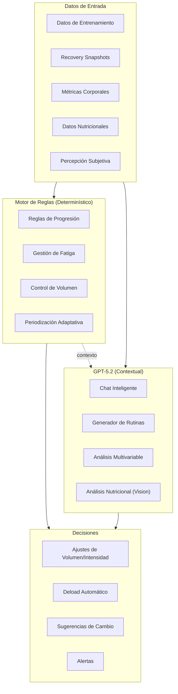
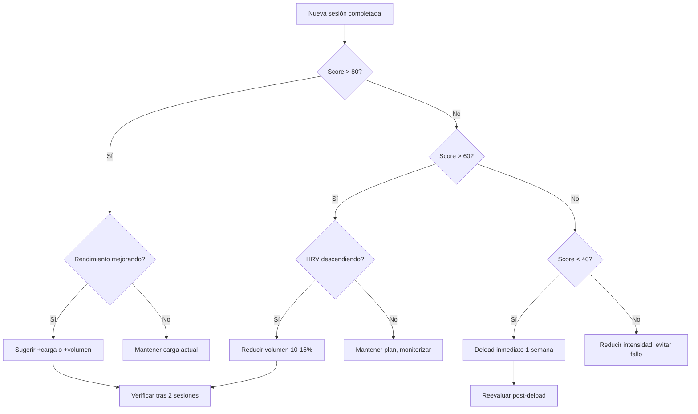

# 🧠 Motor de IA — GymFit

> **Tipo de documento:** Explanation (Diataxis)
> Explica las decisiones de diseño, reglas y flujos del motor inteligente.

---

## Filosofía del Motor

El motor de IA de GymFit no es un simple generador de rutinas. Es un **sistema de toma de decisiones basado en datos**, compuesto por dos capas complementarias:

1. **Motor de reglas determinísticas** — Reglas claras, medibles y predecibles (if-then)
2. **LLM contextual (GPT-5.2)** — Razonamiento flexible, comunicación natural, análisis complejo



---

## Capa 1: Motor de Reglas Determinísticas

### Reglas de Progresión

Estas reglas se ejecutan **automáticamente** después de cada sesión:

#### Doble Progresión (método por defecto)
```
SI completaste todas las series en el rango alto de reps
   Y tu RIR medio fue ≤ objetivo + 1
ENTONCES → sugiere +2.5/5 kg en la próxima sesión
           y resetea el rango al mínimo de reps

SI no alcanzaste el rango mínimo de reps
   Y llevas 2+ sesiones sin alcanzarlo
ENTONCES → reduce peso un 5-10% y reinicia progresión
```

#### Ejemplo concreto
```
Ejercicio: Press banca
Rango: 6-10 reps | RIR objetivo: 2
Última sesión: 80kg × 10, 10, 9 (RIR: 2, 2, 3)

→ Alcanzó rango alto (10) en 2/3 series con RIR ≈ objetivo
→ Sugerencia: subir a 82.5kg, objetivo 6-8 reps
```

### Reglas de Ajuste por Recuperación

```
SI HRV desciende >15% respecto a media 7 días
   Y FC reposo sube >10%
ENTONCES → reducir volumen 10-20%
           evitar trabajo al fallo (RIR mínimo = 3)

SI sueño < 6 horas
ENTONCES → evitar trabajo al fallo
           reducir volumen del top set

SI tendencia de recuperación positiva 2+ semanas
   Y rendimiento estable o mejorando
ENTONCES → permitir aumento de volumen (+1-2 series en músculo prioritario)
```

### Detección de Estancamiento

```
SI e1RM estimado no mejora en 3-6 semanas para un ejercicio
ENTONCES → marcar como "meseta"
           sugerir: cambiar variante, ajustar rango de reps,
           o modificar frecuencia semanal para ese músculo

SI rendimiento cae progresivamente durante 2+ semanas
   Y no hay factor externo identificado (sueño normal, no enfermedad)
ENTONCES → planificar deload automático (1 semana)
           reducir volumen 40-60%, mantener intensidad al 60-70%
```

### Control de Volumen Individual

```
SI volumen semanal < MEV estimado
ENTONCES → alertar: "Volumen insuficiente para mantener adaptaciones"

SI volumen semanal > MRV estimado
ENTONCES → alertar: "Riesgo de sobreentrenamiento"
           recortar volumen al rango MAV

SI series con RIR > 4 superan el 30% del volumen total
ENTONCES → alertar: "Junk volume detectado"
           sugerir reducir series y aumentar intensidad
```

---

## Capa 2: GPT-5.2 (Contextual)

### Prompt System (estructura)

El sistema construye un prompt contextual para cada interacción:

```
[SYSTEM]
Eres un entrenador personal experto en hipertrofia y fuerza,
basado en evidencia científica. Tienes acceso a los datos
reales del usuario y debes tomar decisiones racionales.

Nunca inventes datos. Si no tienes información suficiente,
dilo claramente y pide los datos necesarios.

Prioriza: seguridad > recuperación > progresión > volumen.

[CONTEXTO DEL USUARIO]
- Nivel: Intermedio (2 años entrenando)
- Objetivo: Hipertrofia
- Fase actual: Bloque de acumulación, semana 3/6
- Score global: 78/100 (tendencia: estable)

[ÚLTIMO ENTRENAMIENTO]
- Push Day A (hace 2 días)
- Press banca: 82.5kg × 8, 7, 6 (RIR: 2, 3, 3)
- Press inclinado DB: 30kg × 10, 9, 8 (RIR: 2, 2, 3)
- Aperturas cable: 15kg × 12, 12, 11 (RIR: 1, 2, 2)
- Energía: 7/10, Duración: 65 min

[RECUPERACIÓN]
- HRV: 48ms (media 7d: 52ms) ↓ ligeramente
- FC reposo: 62 bpm (media: 58) ↑ ligeramente
- Sueño: 6.5h (meta: 7.5h)
- Energía subjetiva: 6/10

[TENDENCIA 4 SEMANAS]
- Press banca e1RM: 95kg → 98kg → 100kg → 101kg (+6.3%)
- Volumen pecho semanal: 14 series efectivas
- Adherencia: 11/12 sesiones (91%)

[ALERTAS ACTIVAS]
- Sueño por debajo de 7h las últimas 3 noches
```

### Casos de Uso del Chat

| Mensaje del usuario | Contexto que evalúa GPT-5.2 | Tipo de respuesta |
|---------------------|---------------------------|-------------------|
| "Hoy me siento sin energía" | HRV, sueño, FC reposo, última sesión | Reducir intensidad, sesión técnica/ligera |
| "No progreso en press banca" | Tendencia e1RM 4-8 semanas, volumen pecho, frecuencia | Cambiar variante, ajustar rango, añadir frecuencia |
| "Me duele el hombro" | Historial de ejercicios, volumen empuje | Variante más segura, reducir ROM, ajustar volumen |
| "¿Debería hacer deload?" | Score global, fatiga acumulada, tendencia rendimiento | Decisión basada en datos objetivos + subjetivos |
| "Genera una rutina PPL" | Nivel, objetivo, equipo, lesiones, recuperación | Programa completo con periodización y progresión |

### Generación de Rutinas

GPT-5.2 recibe un prompt estructurado con:
- Objetivo, nivel, días disponibles, duración por sesión
- Equipamiento disponible
- Historial de lesiones o molestias marcadas
- Músculos prioritarios (detectados como rezagados o elegidos por el usuario)
- Capacidad de recuperación actual (último score)
- Formato de salida esperado (JSON para importar directamente a la app)

---

## Score Global (0-100)

### Fórmula

```typescript
function calculateGlobalScore(data: ScoreInput): number {
  const weights = {
    performance: 0.30,
    recovery: 0.25,
    workload: 0.20,
    adherence: 0.15,
    alerts: 0.10
  };

  const performance = calculatePerformanceScore(data.recentWorkouts);
  const recovery = calculateRecoveryScore(data.latestSnapshot);
  const workload = calculateWorkloadScore(data.weeklyVolume);
  const adherence = calculateAdherenceScore(data.planned, data.completed);
  const alerts = calculateAlertPenalty(data.alerts);

  return Math.round(
    performance * weights.performance +
    recovery * weights.recovery +
    workload * weights.workload +
    adherence * weights.adherence -
    alerts * weights.alerts
  );
}
```

### Interpretación

| Rango | Color | Significado | Acción de la IA |
|-------|-------|------------|----------------|
| 80-100 | 🟢 Verde | Progresión + buena recuperación | Apretar: permitir aumento de volumen |
| 60-79 | 🟡 Amarillo | Progreso OK, vigilar fatiga | Mantener: no aumentar, monitorizar |
| < 60 | 🔴 Rojo | Fatiga acumulada probable | Descargar: programar deload |

---

## Flujo de Decisión Completo


