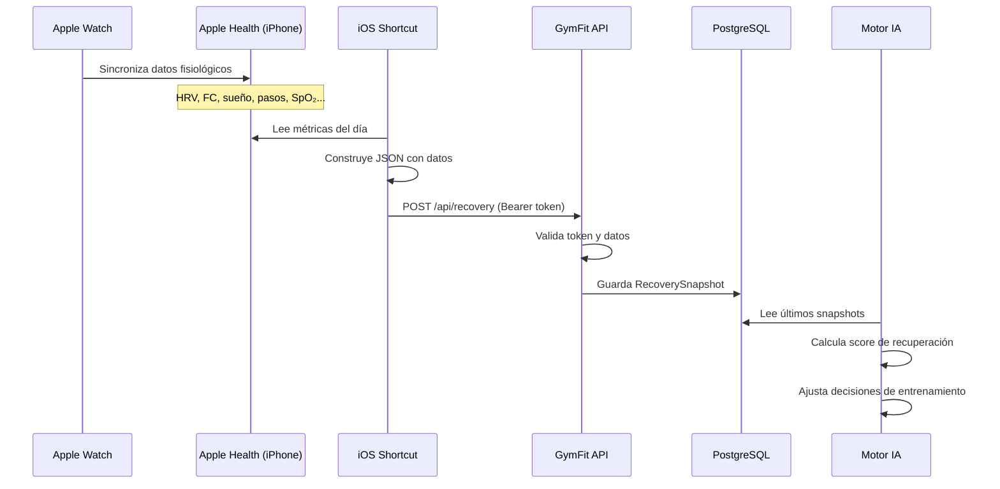
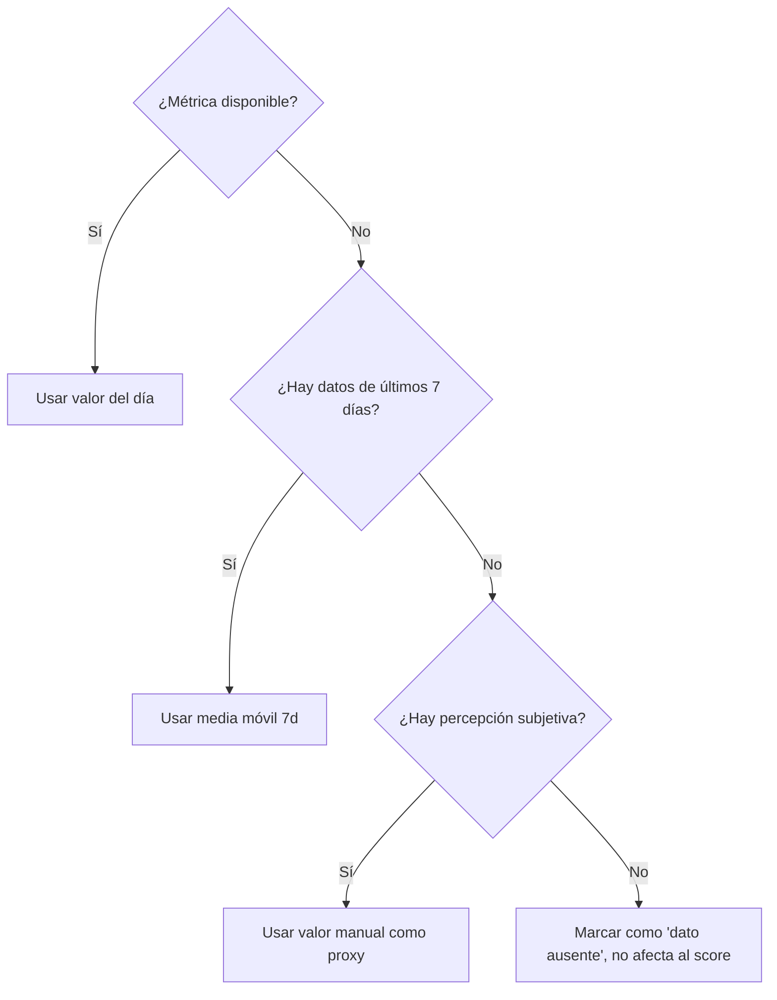

# ⌚ Integración Apple Watch — GymFit

> **Tipo de documento:** Explanation (Diataxis)
> Explica por qué se elige este enfoque, cómo funciona conceptualmente y qué limitaciones tiene.

---

## El Problema

GymFit es un proyecto **web (PWA)**. Un proyecto web no puede acceder directamente a HealthKit (la base de datos de salud de Apple). HealthKit es exclusivo de apps nativas de iOS/watchOS, que requieren Mac + Xcode + Apple Developer Program.

Sin embargo, los datos del Apple Watch (HRV, frecuencia cardiaca, sueño, etc.) son fundamentales para el motor inteligente de GymFit.

---

## La Solución: Shortcuts como Puente

iOS Shortcuts (Atajos) es la única herramienta que puede:
1. ✅ Leer datos de Apple Health (donde el Watch sincroniza)
2. ✅ Hacer peticiones HTTP (POST con JSON)
3. ✅ Automatizarse (ejecutar diariamente)
4. ✅ Funcionar sin Mac ni programa de desarrollador

### Pipeline Completo

---

## El Recovery Snapshot

Un "Recovery Snapshot" es un **resumen fisiológico diario** que representa tu estado de recuperación. En lugar de almacenar miles de datos crudos del Watch, se genera **un registro por día** con las métricas más relevantes.

### Métricas incluidas

| Métrica | Fuente | Prioridad | Disponibilidad en Shortcuts |
|---------|--------|-----------|----------------------------|
| Frecuencia cardiaca en reposo | Apple Watch | 🔴 Alta | ✅ Fácil (casi siempre disponible) |
| Pasos / Energía activa | Apple Watch | 🔴 Alta | ✅ Fácil |
| Horas de sueño | Apple Watch | 🔴 Alta | ✅ Fácil (con app de sueño activa) |
| HRV (SDNN) | Apple Watch | 🔴 Alta | ⚠️ Variable (no siempre accesible) |
| SpO₂ | Apple Watch | 🟡 Media | ⚠️ Variable |
| Temperatura corporal | Apple Watch | 🟡 Media | ⚠️ Variable (serie 8+) |
| Frecuencia respiratoria | Apple Watch | 🟢 Baja | ⚠️ Variable |
| Energía subjetiva (1-10) | Manual | 🔴 Alta | ✅ Input en el Shortcut |
| Estrés percibido (1-10) | Manual | 🟡 Media | ✅ Input en el Shortcut |

---

## Estrategia Anti-Fallos

El sistema está diseñado para funcionar **incluso con datos incompletos**:

### Nivel 1: Dato disponible
Se usa el valor del día tal cual.

### Nivel 2: Dato no disponible → Fallback automático
Si una métrica viene como `null` (Shortcuts no pudo leerla), el backend calcula la **media móvil de los últimos 7 días** como estimación.

### Nivel 3: Señal manual
Si las métricas objetivas fallan consistentemente, el campo `subjectiveEnergy` (1-10) que el usuario introduce manualmente proporciona una señal de respaldo.

### Nivel 4: Importación XML (respaldo total)
Apple Health permite exportar "Todos los datos de Salud" como un archivo ZIP con XML. GymFit tendrá un endpoint (futuro) para importar este XML y rellenar huecos en el histórico.

---

## Seguridad

Para uso personal, la seguridad es mínima pero suficiente:

| Aspecto | Implementación |
|---------|---------------|
| Autenticación | Header `Authorization: Bearer <TOKEN>` |
| Token | Cadena aleatoria de 64 caracteres, configurada en `.env.local` |
| Validación | El backend verifica el token antes de procesar cualquier snapshot |
| HTTPS | Obligatorio (el iPhone no permite POST a HTTP desde Shortcuts sin configuración extra) |

---

## Limitaciones Conocidas

| Limitación | Impacto | Mitigación |
|-----------|---------|-----------|
| Shortcuts no accede a todas las métricas de HealthKit | Puede faltar HRV o SpO₂ | Fallback automático (media 7d) + valor subjetivo |
| La automatización de Shortcuts en iOS necesita confirmación | No es 100% push automático sin intervención | Crear un recordatorio diario para ejecutar el Shortcut |
| Export XML es manual y grande | Solo para recuperar histórico | Se usa como respaldo puntual, no diario |
| Sin datos en tiempo real | Los datos llegan como resumen diario, no streaming | Suficiente para decisiones de periodización (no operan en tiempo real) |

---

## ¿Por Qué No Otras Alternativas?

### ¿Por qué no iCloud?
iCloud no ofrece una API pública para leer datos de Salud. Los datos de HealthKit no están en iCloud Drive ni son accesibles vía web.

### ¿Por qué no crear una app nativa?
Requiere Mac + Xcode + Apple Developer Program ($99/año). Para uso personal y un proyecto web, Shortcuts es la solución más pragmática.

### ¿Por qué no apps de terceros como Health Auto Export?
Son una opción viable (exportan datos de HealthKit a CSV/JSON/Google Sheets). Pero Shortcuts es nativo, gratis, sin dependencias de terceros y suficiente para el MVP.
