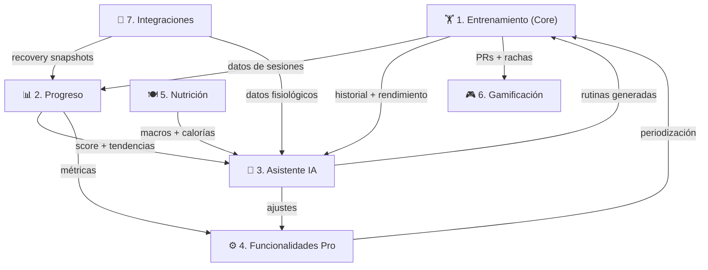

# 🧩 Módulos del Sistema — GymFit

> **Tipo de documento:** Explanation (Diataxis)
> Explica el porqué de cada módulo, sus responsabilidades y cómo se relacionan.

---

## Visión General

GymFit se organiza en 7 módulos funcionales. Cada módulo tiene una responsabilidad clara, pero se comunican entre sí a través de datos compartidos en la base de datos y servicios de dominio.



---

## Módulo 1: Entrenamiento (Core)

**Responsabilidad:** Todo lo relacionado con la planificación y ejecución de entrenamientos.

### ¿Por qué es el módulo central?
Sin datos de entrenamiento de calidad, la IA no tiene material para optimizar. Este módulo prioriza la **mínima fricción** al registrar para que nunca sea una barrera.

### Componentes

| Componente | Función | Por qué importa |
|-----------|---------|-----------------|
| **Rutinas y Programas** | Crear y gestionar planes por bloques (4-12 semanas) | Permite periodización estructurada |
| **Ejecución (Logging)** | Registrar series, reps, peso, RIR en tiempo real | El dato crudo que alimenta todo el sistema |
| **Calidad del Estímulo** | Calcular series efectivas, detectar junk volume | No todo volumen es igual: el que importa es el cercano al fallo |
| **Biblioteca de Ejercicios** | Catálogo filtrable con cues, variantes y notas | Base de conocimiento para prescripción inteligente |
| **Progresión** | Reglas automáticas de subida de peso/reps | Implementa sobrecarga progresiva de forma medible |
| **Historial** | Registro completo por sesión y ejercicio, PRs, e1RM | La memoria del sistema, base para tendencias |

### Diseño de UX clave
El formulario de logging debe permitir registrar una serie completa en **2-3 toques** (autocompletado con sesión anterior + "+1 serie" rápido). El temporizador de descansos se activa automáticamente.

---

## Módulo 2: Progreso

**Responsabilidad:** Interpretar datos y convertirlos en información accionable.

### ¿Por qué no basta con gráficas?
Una gráfica muestra datos; este módulo los **interpreta**. El score 0-100 resume tu estado en un número. Las tendencias de 4-8 semanas revelan patrones que día a día no se ven.

### Componentes

| Componente | Función |
|-----------|---------|
| **Score Global (0-100)** | Índice ponderado: rendimiento + recuperación + volumen + adherencia |
| **Métricas de Rendimiento** | Progresión de peso, e1RM dinámico, velocidad de progreso |
| **Volumen e Intensidad** | Volumen semanal por músculo, series efectivas, densidad |
| **Tendencias Fisiológicas** | Correlación HRV ↔ rendimiento, sueño ↔ progreso |
| **Progreso Físico** | Fotos comparativas, medidas corporales, peso suavizado |
| **Interpretación IA** | Cruza datos visuales + métricas + rendimiento para detectar ganancia/pérdida real |

### Score Global — Desglose

| Componente | Peso | Fuente de datos |
|-----------|------|----------------|
| Rendimiento | 30% | Tendencia e1RM, PRs, reps completadas |
| Recuperación | 25% | HRV, FC reposo, sueño, energía subjetiva |
| Volumen/Carga | 20% | Series efectivas semanales, densidad |
| Adherencia | 15% | Sesiones completadas vs planificadas |
| Alertas | 10% | Dolor, fatiga extrema, caída de rendimiento |

---

## Módulo 3: Asistente IA (GPT-5.2)

**Responsabilidad:** Actuar como entrenador personal basado en datos reales.

### ¿Por qué un LLM y no solo reglas?
Las reglas de progresión (Módulo 4) cubren decisiones automáticas. El LLM aporta:
- **Contexto conversacional** (entender "hoy estoy roto" y decidir qué hacer)
- **Razonamiento complejo** (cruzar muchas variables a la vez)
- **Comunicación natural** (explicar sus decisiones como un entrenador real)
- **Flexibilidad** (manejar situaciones no previstas por las reglas)

### Componentes

| Componente | Función |
|-----------|---------|
| **Generador de Rutinas** | Construye programas según objetivo, nivel, equipo, lesiones, recuperación |
| **Progresión Automática** | Aplica reglas de datos para sugerir cambios de carga/volumen |
| **Chat Contextual** | Responde con acceso a último entreno, tendencias, recuperación, fase actual |
| **Análisis Multivariable** | Cruza rendimiento + recuperación + volumen + adherencia + fotos |

### Contexto que recibe GPT-5.2

El sistema construye un **prompt contextual** antes de cada interacción con la IA, incluyendo:
- Último entrenamiento (ejercicios, sets, rendimiento vs objetivo)
- Tendencia de rendimiento (4 últimas semanas)
- Recovery Snapshot más reciente (HRV, sueño, FC)
- Score global actual y su tendencia
- Fase actual del programa (bloque, semana)
- Alertas activas (dolor, fatiga, estancamiento)

---

## Módulo 4: Funcionalidades Pro (Motor Inteligente)

**Responsabilidad:** Lógica de negocio avanzada basada en reglas científicas.

### ¿Por qué separar esto del Módulo 3 (IA)?
El Motor Pro contiene **reglas determinísticas** (if-then basadas en datos). No necesitan LLM. Son predecibles y auditables. El LLM (Módulo 3) se apoya en estas reglas pero añade razonamiento flexible.

### Componentes

| Componente | Función |
|-----------|---------|
| **Periodización Adaptativa** | Ajusta el tipo de periodización según respuesta individual |
| **Ajuste por Biofeedback** | Reglas HRV/sueño/FC → ajustes de volumen e intensidad |
| **Análisis Corporal** | Detección de músculos rezagados, recomendación de especialización |
| **Motor de Decisión** | Reglas basadas en MEV/MAV/MRV, tendencias, fatiga acumulada |
| **Calculadoras** | e1RM, volumen óptimo, ratio estímulo/fatiga, calorías ajustadas |

---

## Módulo 5: Nutrición

**Responsabilidad:** Registro y seguimiento nutricional con ayuda de IA.

### ¿Por qué IA para fotos de comida?
El mayor problema del tracking nutricional es la fricción. Registrar cada ingrediente manualmente es insostenible. Con GPT-5.2 Vision:
1. Haces foto → la IA identifica el plato
2. Estima macros → te muestra el resultado
3. Chat de verificación → 2-5 preguntas rápidas para afinar
4. Resultado verificado → se guarda

### Componentes

| Componente | Función |
|-----------|---------|
| **Análisis por Foto** | GPT-5.2 Vision analiza imagen y estima macros |
| **Chat de Verificación** | Preguntas rápidas para mejorar precisión |
| **Seguimiento Diario** | Calorías y macros acumulados del día |
| **Objetivos por Fase** | Targets calóricos según volumen/definición/recomp |
| **Tendencias** | Adherencia semanal, macros promedio, evolución |

---

## Módulo 6: Gamificación

**Responsabilidad:** Motivación y engagement a largo plazo.

### ¿Por qué gamificación en una app personal?
Incluso sin componente social, la gamificación interna ayuda a mantener la consistencia. Visualizar rachas, celebrar PRs y desbloquear logros genera un **feedback loop positivo**.

### Elementos
- **Rachas** — Días/semanas consecutivos entrenando según el plan
- **PRs destacados** — Alertas automáticas cuando se bate un récord personal
- **Logros/Badges** — Hitos (100 sesiones, 1 año entrenando, etc.)
- **Ranking personal** — Comparación contigo mismo en diferentes periodos

---

## Módulo 7: Integraciones (Apple Watch)

**Responsabilidad:** Conectar datos externos con el sistema.

### ¿Por qué Shortcuts y no una app nativa?
Sin Mac ni Apple Developer Program, no se puede crear una app para watchOS/iOS que lea HealthKit directamente. iOS Shortcuts es el **único puente viable** que:
- Lee datos de Apple Health (donde el Watch sincroniza todo)
- Puede hacer HTTP POST a un endpoint
- Se puede automatizar con Automations de iOS

### Flujo
```
Apple Watch → Apple Health → iPhone Shortcuts → POST /api/recovery → GymFit DB
```

Ver [Apple Watch Integration](APPLE_WATCH_INTEGRATION.md) para detalles.
