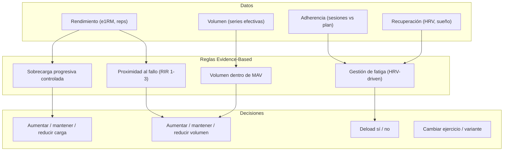

# 🔬 Base Científica — GymFit

> **Tipo de documento:** Explanation (Diataxis)
> Explica los principios científicos que fundamentan las decisiones del motor inteligente.

---

## Enfoque: Evidence-Based Training

GymFit no toma decisiones por intuición. Cada regla del motor inteligente está respaldada por principios de la ciencia del entrenamiento. El objetivo es que la IA actúe con **reglas medibles** basadas en la relación rendimiento + recuperación.

---

## Principios Fundamentales

### 1. Sobrecarga Progresiva

**Principio:** Para que el músculo crezca, necesita un estímulo progresivamente mayor con el tiempo.

**Aplicación en GymFit:**
- Doble progresión: subir reps → cuando se alcanza el tope, subir peso
- Tracking de e1RM para verificar tendencia ascendente
- Alertas si e1RM se estanca 3-6 semanas

**Evidencia:** Es el principio más fundamental del entrenamiento de fuerza. Sin sobrecarga progresiva, no hay adaptación (Kraemer & Ratamess, 2004; Schoenfeld, 2010).

---

### 2. Especificidad

**Principio:** Las adaptaciones son específicas al tipo de estímulo aplicado.

**Aplicación en GymFit:**
- Rangos de repeticiones prescritos según objetivo:
  - **Hipertrofia:** 6-15 reps (la mayoría del trabajo)
  - **Fuerza:** 1-5 reps (trabajo complementario)
  - **Resistencia muscular:** 15-30 reps (accesorio/metabólico)
- Selección de ejercicios por patrón de movimiento relevante
- Periodización que varía el estímulo según la fase

---

### 3. Proximidad al Fallo

**Principio:** Las series más efectivas para hipertrofia son las que se realizan cerca del fallo muscular (RIR 0-3). Series con RIR alto (>4-5) producen menos estímulo relativo.

**Aplicación en GymFit:**
- Cálculo de "series efectivas" (RIR ≤ 3 = serie efectiva)
- Detección de "junk volume" (series con RIR alto que no contribuyen)
- RIR objetivo por fase: acumulación (RIR 2-3), intensificación (RIR 0-2), deload (RIR 4-5)

**Evidencia:** Las últimas 5 repeticiones antes del fallo son las que reclutan las fibras musculares de alto umbral, responsables del mayor potencial de crecimiento (Schoenfeld et al., 2021; Refalo et al., 2022).

---

### 4. Volumen Individualizado

**Principio:** Existe un rango de volumen óptimo para cada persona y cada músculo. Demasiado poco no estimula; demasiado genera fatiga sin beneficio adicional.

**Aplicación en GymFit:**
- Tracking de volumen semanal por grupo muscular (series efectivas)
- Estimación de MEV, MAV y MRV individual basada en respuesta observada
- Rangos orientativos iniciales:

| Grupo muscular | MEV (series/semana) | MAV | MRV |
|---------------|--------------------|----|-----|
| Pecho | 6-8 | 12-16 | 20-22 |
| Espalda | 6-8 | 14-18 | 22-25 |
| Cuádriceps | 6-8 | 12-16 | 20-22 |
| Isquiotibiales | 4-6 | 10-14 | 16-18 |
| Hombros (lateral) | 6-8 | 14-20 | 22-26 |
| Bíceps | 4-6 | 10-14 | 18-20 |
| Tríceps | 4-6 | 8-12 | 16-18 |
| Glúteos | 4-6 | 10-14 | 18-20 |

> Estos valores son orientativos. GymFit los ajusta individualmente según la respuesta observada (rendimiento + recuperación).

**Evidencia:** Schoenfeld & Krieger (2017) — meta-análisis mostrando relación dosis-respuesta entre volumen e hipertrofia, con rendimientos decrecientes a partir de cierto punto. Israetel et al. (2019) — concepto de MEV/MAV/MRV como modelo práctico de volumen individual.

---

### 5. Gestión de Fatiga

**Principio:** La fatiga se acumula con el entrenamiento. Si no se gestiona, el rendimiento cae y el riesgo de sobreentrenamiento funcional aumenta.

**Aplicación en GymFit:**
- Monitorización de HRV + FC reposo + sueño como indicadores de fatiga sistémica
- Reglas de ajuste automático:
  - HRV ↓ + FC ↑ → reducir volumen 10-20%
  - Sueño < 6h → evitar trabajo al fallo
  - Score < 60 → programar deload
- Deloads estructurados: 1 semana cada 4-8 semanas (según tolerancia individual)

**Evidencia:** El modelo de fitness-fatigue (Banister, 1975) establece que el rendimiento es la diferencia entre adaptaciones acumuladas y fatiga acumulada. La HRV es un marcador válido de carga alostática y estado del sistema nervioso autónomo (Plews et al., 2013).

---

### 6. Individualización

**Principio:** No existe un programa universal óptimo. La respuesta al entrenamiento varía enormemente entre individuos.

**Aplicación en GymFit:**
- Todo se basa en **datos reales** del usuario, nunca en promedios
- El motor aprende de la respuesta individual:
  - Si un músculo crece con menos volumen → ajustar MEV/MRV
  - Si un ejercicio causa dolor → marcar como "evitar" y sugerir variante
  - Si la recuperación es lenta → reducir frecuencia o volumen
- El score global se personaliza en función de la sensibilidad de cada componente

---

## Reglas de Decisión del Motor (Resumen Científico)

---

## Referencias Bibliográficas

1. Schoenfeld, B.J. (2010). *The mechanisms of muscle hypertrophy and their application to resistance training.* Journal of Strength and Conditioning Research.
2. Schoenfeld, B.J. & Krieger, J.W. (2017). *Dose-response relationship between weekly resistance training volume and increases in muscle mass.* Medicine and Science in Sports and Exercise.
3. Refalo, M.C. et al. (2022). *Influence of resistance training proximity-to-failure on skeletal muscle hypertrophy.* Sports Medicine.
4. Israetel, M., Hoffmann, J., & Davis, M.C. (2019). *Scientific Principles of Hypertrophy Training.* Renaissance Periodization.
5. Plews, D.J. et al. (2013). *Heart-Rate Variability and Training-Intensity Distribution in Elite Rowers.* International Journal of Sports Physiology and Performance.
6. Banister, E.W. (1975). *Modeling elite athletic performance.* In: Physiological Testing of Elite Athletes, Human Kinetics.
7. Kraemer, W.J. & Ratamess, N.A. (2004). *Fundamentals of resistance training: progression and exercise prescription.* Medicine and Science in Sports and Exercise.
