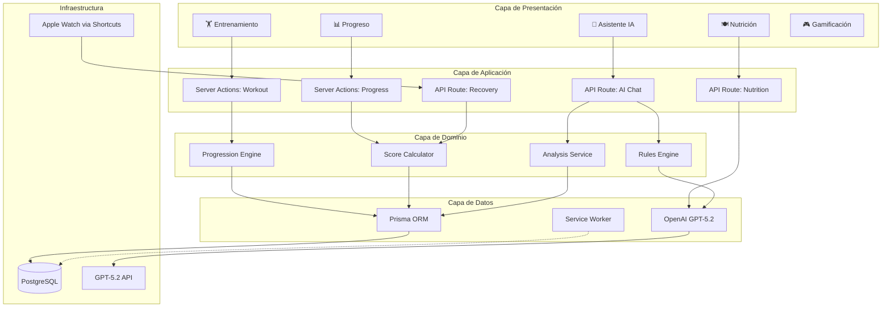
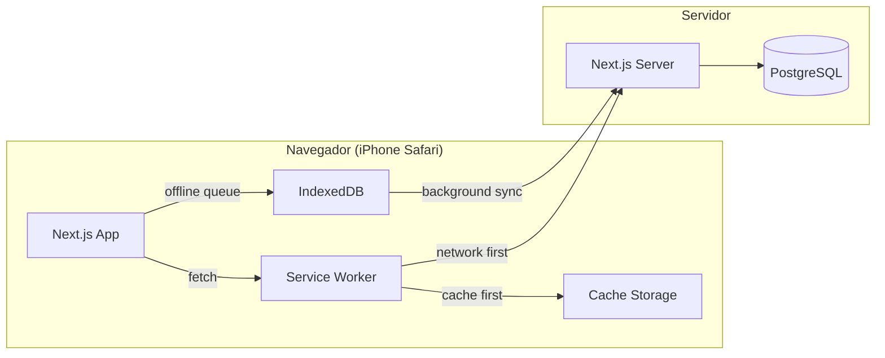

# 🏗️ Arquitectura Técnica — GymFit

> **Tipo de documento:** Reference (Diataxis)
> Descripción factual de la arquitectura del sistema.

---

## Patrón Arquitectónico

GymFit utiliza **Next.js 15 con App Router**, combinando Server Components y Client Components según la necesidad de cada vista. La arquitectura sigue un modelo por capas:

```
┌─────────────────────────────────────────────────────────┐
│                    PRESENTATION LAYER                    │
│  React Server Components + Client Components (Shadcn)   │
├─────────────────────────────────────────────────────────┤
│                    APPLICATION LAYER                     │
│  Server Actions / API Routes / Service Functions         │
├─────────────────────────────────────────────────────────┤
│                     DOMAIN LAYER                         │
│  Business Logic / AI Rules Engine / Progression Rules    │
├─────────────────────────────────────────────────────────┤
│                      DATA LAYER                          │
│  Prisma ORM / OpenAI Client / Apple Watch Receiver       │
├─────────────────────────────────────────────────────────┤
│                    INFRASTRUCTURE                        │
│  PostgreSQL / OpenAI GPT-5.2 API / Service Worker (PWA)  │
└─────────────────────────────────────────────────────────┘
```

---

## Diagrama de Módulos



---

## Flujo de Datos

### Server Components (por defecto)
- Páginas de dashboard, historial, gráficas
- Acceso directo a Prisma sin API intermedia
- Renderizado en servidor, menor JS en cliente

### Client Components (`'use client'`)
- Formulario de logging de entreno (interactividad en tiempo real)
- Chat con IA (streaming de respuestas)
- Temporizador de descansos
- Cámara para fotos (nutrición/progreso)

### API Routes (`/api/*`)
- `POST /api/recovery` — Receptor de datos de Apple Watch (Shortcuts)
- `POST /api/ai/chat` — Chat con GPT-5.2 (streaming)
- `POST /api/ai/nutrition` — Análisis de foto de comida
- `POST /api/ai/generate-routine` — Generación de rutinas

---

## PWA Architecture



**Estrategia de caching:**
| Recurso | Estrategia | Razón |
|---------|-----------|-------|
| HTML/CSS/JS estáticos | Cache First | Raramente cambian, carga instantánea |
| API de datos (entrenos, métricas) | Network First | Datos frescos prioritarios, cache como fallback |
| Imágenes (ejercicios) | Cache First | Assets estáticos, 30 días |
| API de IA | Network Only | Requiere conexión, no cacheable |

---

## Estructura de Directorios (código fuente)

```
src/
├── app/                          # Next.js App Router
│   ├── (dashboard)/              # Route group: vistas principales
│   │   ├── train/                # Módulo de entrenamiento
│   │   ├── progress/             # Módulo de progreso
│   │   ├── ai/                   # Asistente IA
│   │   ├── nutrition/            # Nutrición
│   │   └── profile/              # Perfil y gamificación
│   ├── api/                      # API Routes
│   │   ├── recovery/             # Endpoint Apple Watch
│   │   ├── ai/                   # Endpoints de IA
│   │   └── [...]/                # Resto de endpoints
│   ├── layout.tsx                # Layout raíz
│   └── page.tsx                  # Página principal
├── components/                   # Componentes compartidos
│   ├── ui/                       # Shadcn UI components
│   └── workout/                  # Componentes de entrenamiento
├── lib/                          # Lógica de negocio
│   ├── services/                 # Servicios de dominio
│   ├── ai/                       # Cliente OpenAI + prompts
│   ├── rules/                    # Reglas de progresión
│   └── utils/                    # Utilidades
├── prisma/                       # Esquema y migraciones
│   └── schema.prisma
└── public/                       # Assets estáticos
    ├── manifest.json             # PWA manifest
    ├── icons/                    # PWA icons
    └── offline.html              # Fallback offline
```

---

## Seguridad

| Aspecto | Implementación |
|---------|---------------|
| Apple Watch endpoint | Bearer token en header `Authorization` |
| Variables de entorno | `.env.local` (nunca en git) |
| API de OpenAI | API key en server-side only |
| HTTPS | Obligatorio para PWA + Service Worker |
| CORS | Restringido al dominio de la app |

---

## Escalabilidad

Al ser un proyecto de uso personal, la arquitectura prioriza **simplicidad** sobre escalabilidad horizontal:
- Servidor único (VPS o Vercel)
- Base de datos PostgreSQL única
- Sin microservicios ni colas de mensajes
- Sin CDN externo (Next.js sirve los assets)
