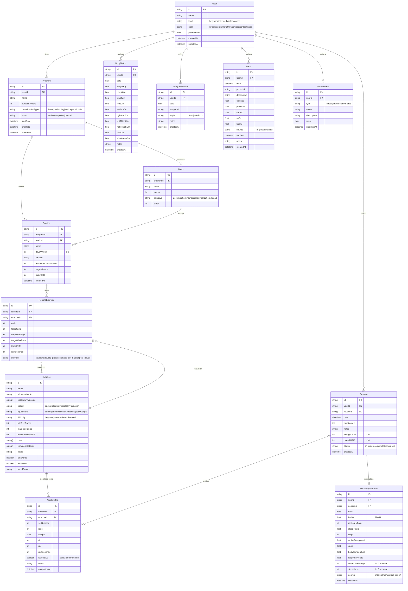

# 🗃️ Modelo de Datos — GymFit

> **Tipo de documento:** Reference (Diataxis)
> Descripción factual del esquema de base de datos.

---

## Diagrama Entidad-Relación

---

## Entidades Principales

### User
Perfil del usuario con nivel, objetivo y preferencias. Relación raíz con todos los demás datos.

### Program → Block → Routine → RoutineExercise
Jerarquía de planificación: un programa contiene bloques (fases de periodización), cada bloque tiene rutinas asignadas a días, y cada rutina contiene ejercicios con prescripción específica (series, reps, RIR, método de progresión).

### Exercise
Biblioteca de ejercicios con clasificación por músculo, patrón de movimiento, equipamiento y dificultad. Incluye cues de técnica, errores comunes, y flags personales (favorito/evitar).

### Session → WorkoutSet
Registro de entrenamiento real. Una sesión agrupa todos los sets ejecutados en un entreno. Cada `WorkoutSet` registra reps, peso, RIR/RPE y calcula automáticamente si es una **serie efectiva** (cerca del fallo).

### RecoverySnapshot
Datos fisiológicos diarios procedentes del Apple Watch vía iOS Shortcuts. Incluye fallback a valores manuales (`subjectiveEnergy`, `stressLevel`). Campo `source` indica la procedencia del dato.

### BodyMetric / ProgressPhoto
Registro de progreso corporal: medidas periódicas y fotos comparativas.

### Meal
Registro nutricional con análisis por foto (IA) o entrada manual. Incluye flag de verificación post-análisis.

### Achievement
Sistema de gamificación: rachas de entrenamiento, PRs, hitos y badges.

---

## Índices Recomendados

| Entidad | Campo(s) | Tipo | Razón |
|---------|---------|------|-------|
| Session | `userId`, `date` | Compuesto | Consultas de historial por fecha |
| WorkoutSet | `sessionId` | Simple | Recuperar sets de una sesión |
| WorkoutSet | `exerciseId` | Simple | Historial por ejercicio |
| RecoverySnapshot | `userId`, `date` | Compuesto, Único | Un snapshot por día |
| BodyMetric | `userId`, `date` | Compuesto | Tendencia corporal |
| Exercise | `primaryMuscle` | Simple | Filtro por músculo |
| Exercise | `pattern` | Simple | Filtro por patrón |

---

## Campos Calculados (no persistidos)

Estos valores se calculan en tiempo real dentro de los servicios:

| Campo | Fórmula / Lógica |
|-------|-----------------|
| `e1RM` | Peso × (1 + Reps / 30) — Epley |
| `isEffective` | `true` si RIR ≤ 3 |
| `weeklyVolumePerMuscle` | Σ sets efectivos de la semana para cada músculo |
| `recoveryScore` | Fórmula ponderada (HRV, FC, sueño, energía) |
| `globalScore` | Combinación de rendimiento + recuperación + adherencia |
| `smoothedWeight` | Media móvil exponencial del peso corporal |
